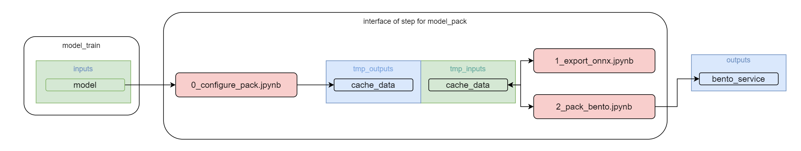

# Step CV-Pipeline: model_pack [RU](README_RU.md)

This CV-Pipeline component is designed to convert the model into various formats (Onnx, OpenVino, TensorRT, etc.) and package the model in BentoService.   
When using the Binary Service, only the weights and the necessary files - configs for launching the service - are packaged.    
When using the REST API, in addition to packaging in the artifact bentoservice, the rest method predict, test_data, test_result is described   


Created based on [template](https://github.com/4-DS/step_template).
In order not to forget about the required cells in each laptop, the easiest way to create new jupyter notebooks is simply by copying [`substep_full.ipynb`](https://github.com/4-DS/step_template/blob/main/substep_full.ipynb) from standard [template](https://github.com/4-DS/step_template).

Input data for step CV-Pipeline: model_pack
- **model**     
Saved weights of the trained model (weights of the last epoch and with the best achieved metrics), configuration files from the previous CV-Pipeline step (model_train)

The final output of this step CV-Pipeline is
- **bento_service**     
bento_service, packaged model service via BentoML (saved as a zip archive)

## How to run a step CV-Pipeline: model_pack

### Create a directory for the project (or use an existing one)
```
mkdir yolox_mmdet
cd yolox_mmdetThis CV-Pipeline component is designed to convert the model into various formats (Onnx, OpenVino, TensorRT, etc.) and package the model in BentoService.
When using the Binary Service, only the weights and the necessary files - configs for launching the service - are packaged.
When using the REST API, in addition to packaging in the artifact bentoservice, the rest method predict, test_data, test_result is described
```  

### clone the repository: model_pack
```
git clone --recurse-submodules https://gitlab.com/yolox_mmdet/model_pack.git {dir name for model_pack}
cd model_pack
```  

### run step CV-Pipeline:model_pack
```
python step.dev.py
```  
or
```
step.prod.py
``` 
