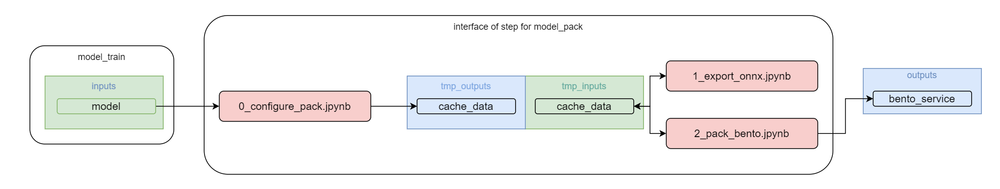

# Step CV-Pipeline: model_train [EN](README.md)

Данная компонент CV-Pipeline предназначен для конвертирования модели в различные форматы (Onnx, OpenVino, TensorRT и др) и упаковка модели в BentoService.      
При использовании Binary Service - упаковываются только веса и необходимые файлы - конфиги для запуска сервиса.     
При использовании REST API, помимо упаковки в artifact bentoservice, описывается rest метод predict, test_data, test_result

Создается на основе [шаблона](https://github.com/4-DS/step_template).
Чтобы не забывать про обязательные ячейки в каждом ноутбуке, проще всего создавать новые ноутбуки просто копированием [`substep_full.ipynb`](https://github.com/4-DS/step_template/blob/main/substep_full.ipynb) из стандартного [шаблона](https://github.com/4-DS/step_template) компоненты.

Входные данные для step CV-Pipeline: model_pack
- **model**     
Сохраненные веса обученной модели (веса последней эпохи и с лучшими достигнутыми метриками), конфигурационные файлы из предыдущего шага CV-Pipeline (model_train)

Конечным выходом работы данного step CV-Pipeline является
- **bento_service**     
bento_service, сервис упакованной модели через BentoML (сохраняется как zip архив)

## Как запустить шаг CV-Pipeline: model_pack

### Создать директорию для проекта (или использовать уже существующую)
```
mkdir yolox_mmdet
cd yolox_mmdet
```  

### склонировать репозиторий model_pack
```
git clone --recurse-submodules https://gitlab.com/yolox_mmdet/model_pack.git {dir_name for model_pack}
cd model_pack
```  

### запустить шаг CV-Pipeline:model_pack
```
python step.dev.py
```  
или
```
step.prod.py
``` 
